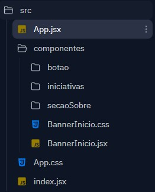
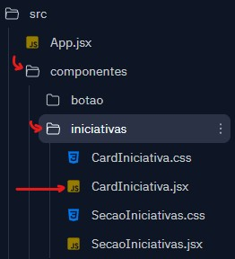

# Aula 5

- [Aula 5](#aula-5)
  - [Objetivos](#objetivos)
  - [Funções no JavaScript](#funções-no-javascript)
    - [Exercícios](#exercícios)
  - [Navegando Arquivos](#navegando-arquivos)
    - [Exercícios](#exercícios-1)
  - [JavaScript com React](#javascript-com-react)
    - [Exercícios](#exercícios-2)
  - [Replit com Erros](#replit-com-erros)

Conforme chegamos ao meio de nosso intensivão, é bom relembrar alguns tópicos chaves e reforçar seus usos.

## Objetivos

Nesta aula, revisitaremos os seguintes tópicos:

- retornos de parâmetros e funções
- `import`/`export`: navegação em arquivos
- código JavaScript dentro do componente react
- uso de `props` no React

Para reforçar essas idéias, estaremos fazendo alguns exercícios juntos.

## Funções no JavaScript

As funções no JavaScript possuem dois conceitos fundamentais: _parâmetros_ e _retorno_.

Uma função típica do JavaScript é declarada da seguinte forma:

```js
function nomeDaFuncao(parametros) {
  // codigo
  return valorDeRetorno;
}
```

Funções são como fábricas, que recebem um material de entrada (os _parâmetros_), fazem algum tipo de processo com o material, e retornam um produto final (o _retorno_).

Por exemplo, uma fábrica de carros pode receber como material de entrada quatro portas, quatro rodas, e a cabine do carro.
O processo dentro da fábrica é a montagem do carro, e o produto final é um carro montado:

```js
function fabricaDeCarros(portas, rodas, cabine) {
  // ..codigo para a montagem do carro
  return carroPronto;
}
```

Como um exemplo mais concreto, podemos fazer uma função que multiplica dois números.
Como material de entrada (_parâmetro_), passamos dois números e como produto final (_retorno_), temos a multiplicação desses dois números.

```js
function multiplicacao(numero1, numero2) {
  let resultado = numero1 * numero2;
  return resultado;
}
```

É importante manter em mente que o `return` funciona como a saída de nossa fábrica. Então, qualquer coisa que escrevermos depois, não vai fazer parte do nosso código!

O react usa essa noção de fábrica para construirmos nossos componentes.

Por exemplo, nosso componente de `CardIniciativa`:

```jsx
export default function CardIniciativa(props) {
  return (
    <div className="container-card-modal">
      
      <h4>{props.nome}</h4>
    </div>
  );
}
```

Recebemos o material de entrada (_parâmetros_): `props`

E temos um produto final (_retorno_): `return`

Duas grandes diferenças são: os parametros ficam todos dentro do `props`; e o retorno é mais complexo e envolve HTML.

Podemos expandir essas idéias para pensar outros componentes.
Por exemplo, se tivermos um componente CartaoRG que recebe como parâmetros (`props`): foto, nome, numeroRG.

```jsx
export default function CartaoRG(props) {
  return (
    <div>
      
      <h3>{props.nome}</h3>
      <h4>{props.numeroRG}</h4>
    </div>
  );
}
```

### Exercícios

Escreva um componente simples CNH, no estilo do CartaoRG, que receba: nome, dataExpiracao, foto, idade.
Mostre esses props dentro de tags `<p>`.

## Navegando Arquivos

Conforme adicionamos mais componentes no nosso site, a estrutura de nossos arquivos vai ficando cada vez mais complexa.
No momento em que finalizamos a [Aula 3](../semana-3/README.md), nossos arquivos estavam organizados na seguinte forma:



Uma descrição mais detalhada de nossos arquivos:

```
.
│   App.css
│   App.jsx
│   index.jsx
│
└───componentes
    │   BannerInicio.css
    │   BannerInicio.jsx
    │
    ├───botao
    │       Botao.css
    │       Botao.jsx
    │
    ├───iniciativas
    │       CardIniciativa.css
    │       CardIniciativa.jsx
    │       SecaoIniciativas.css
    │       SecaoIniciativas.jsx
    │
    └───secaoSobre
            SecaoContribua.css
            SecaoContribua.jsx
            SecaoSobre.css
            SecaoSobre.jsx
            SecaoSobreComBotao.jsx
            SecaoSobreComChildren.jsx
```

Temos a pasta `componentes`, e dentro dela criamos 3 outras pastas: `botao`, `iniciativas` e `secaoSobre`.
Além disso, a pasta `componentes` também contém os arquivos `BannerInicio.css` e `BannerInicio.jsx`, que não estão dentro de outra pasta.

Quando queremos falar pro React usar um componente no `App.jsx`, nós temos que explicar onde exatamente ele tem que ir procurar nosso componente.
Por exemplo, para fazer o `import` do `CardInitiativa.jsx` dentro de `App.jsx`, precisamos passar as instruções de como chegar ao `CardIniciativa` _a partir_ do `App.jsx`.

Do ponto de vista do `App.jsx`, temos que entrar na pasta `componentes`, depois disso, já dentro da pasta componentes, entramos na pasta `iniciativas`:



Explicando em português, podemos dizer:

> _"Entre na pasta **componentes**, depois entre na pasta iniciativas, aí você vai encontrar o componente CardIniciativa"_

Na língua que o React entende, escrevemos:

> `./componentes/iniciativas/CardIniciativa.jsx`

Mas e se quisermos acessar o CardIniciativa dentro da SecaoSobre?
Como instruções, podemos dizer: _"volte uma pasta, entre na pasta iniciativas, e use o componente CardIniciativa"_

Na língua que o React entende, a instrução de _voltar uma pasta_, é feita como `..`:

> `../iniciativas/CardIniciativa.jsx`

### Exercícios

Considerando nossas pastas, como podemos escrever as instruções para o React acessar os seguintes componentes a partir do `App.jsx`:

1. `SecaoIniciativas.jsx`
2. `SecaoContribua.jsx`
3. `BannerInicio.jsx`

Como desafio, tente acessar o `App.jsx` a partir do `Botao.jsx`.

## JavaScript com React

O React nos permite usar HTML e JavaScript juntos. Antes a gente precisava criar coisas em arquivos separados e ir extraíndo o HTML a partir do JavaScript.
Apesar do React facilitar bastante as coisas nesse sentido, a mistura de JavaScript com HTML pode ser um pouco confusa de entender.

A idéia principal a se entender é que o JavaScript sempre aparece dentro dos bigodinhos (`{}`) no HTML.

Na seguinte função, recebemos uma idade dentro do `props`:

```jsx
export default function MaiorDeIdade(props) {
  let mensagem = "Pode dirigir";
  if (props.idade < 18) mensagem = "Nao pode dirigir";

  return (
    <div>
      <h2>{mensagem}</h2>
    </div>
  );
}
```

Essa função nos retorna uma mensagem que nos diz se a pessoa pode ou não dirigir dependendo da idade.

A nossa lógica JavaScript acontece antes do `return`, e dentro do valor de retorno, usamos a mensagem dentro dos bigodinhos.

Uma outra questão importante sobre o `return` do React especificamente, é que o return só pode ter um elemento HTML.
No nosso componente `MaiorDeIdade`, todo o conteúdo do componente fica dentro de uma única `div`.
Se você parar pra observar, todos os `return` de nossos componentes também vão estar dentro de uma `div`.

Por exemplo, o seguinte `return` é invalido:

```jsx
return (
  <h1>Titulo</h1>
  <p>conteudo</p>
)
```

Pra ficar valido, podemos colocar tudo dentro de uma única `div`:

```jsx
return (
  <div>
    <h1>Titulo</h1>
    <p>conteudo</p>
  </div>
);
```

### Exercícios

Crie um componente que receba uma `palavraChave` dentro de `props`, e nos devolva uma mensagem de "Pode entrar" se a palavra chave estiver correta ou "Não pode entrar" se a palavra estiver incorreta.
Você pode escolher a palavra chave que quiser.

## Replit com Erros

O seguinte replit possui alguns erros. Poderia nos ajudar a concertá-los?

[REPLIT](https://replit.com/@ntmtst/IntensivaoReactRevisaoAula5)

Faça um garfo desse Replit. Para aprender como fazer um garfo, veja a seguinte página: [Fork No Replit](./garfo_replit.md)

Erros:

- O componente `MaiorDeIdade` foi importado errado no `App.jsx`
- O componente `MaiorDeIdade` foi importado errado no `EscolaDeDirecao.jsx`
- Os props do componente `CartaoCPF` não estão funcionando própriamente
- O componente `SalaDeEspera` não esta funcionando

Inclua um componente de cada vez, conforme for arrumando os erros.
