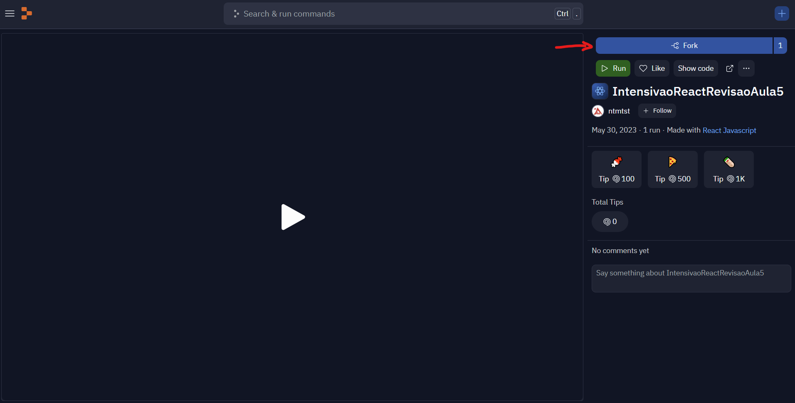
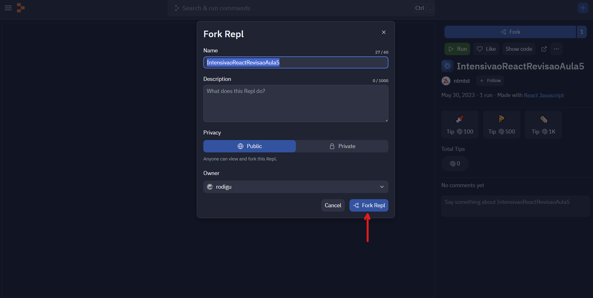

# Fazendo um Fork no Replit

O _fork_ (garfo em português) é como se fosse um cópia de um _repositório_.
Na área de tecnologia, um repositório é um armazém de código.
O nosso projeto de recriar o site do Núcleo de Tecnologia pode ser entendido como um repositório.

Ao abrir o [link do Replit](https://replit.com/@ntmtst/IntensivaoReactRevisaoAula5), clique no botão `fork`:

Então, clique no botão `Fork Replit`:

