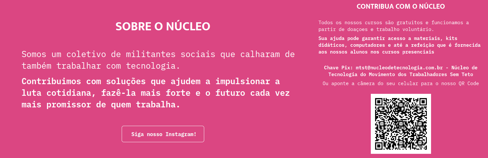

# Aula 6
Olá, nesta aula iremos analisar os nossos componentes gerados até o momento e verificar uma forma de deixá-los mais flexiveis e unificar os códigos gerados

## Similaridades entre os componentes
Observando os componentes 'Sobre o núcleo' e 'Contribua com o núcleo' podemos observar algumas similaridades entre eles.

Os dois componentes tem um fundo rosa com título em branco e um texto centralizado também na cor branca. Também é possivel observar que algumas partes especificas do texto apresentam destaque em negrito e outras não.




## Diferença entre os componentes
A principal diferença que se observa entre os componentes está no conteúdo do botão e da imagem do qrcode, que são informações específicas para cada componente


## Refatorando o código para criar um componente mais flexível

Como já conseguimos identificar as similaridades e diferenças entre os componentes, iremos agora planejar criar um novo componente que abranja todas essas informações de forma a criar um componente único.

Iremos primeiro criar um componente chamado SecaoRefatorada inserindo a props do título

 ```js       
 export default function SecaoRefatorada(props) {
          return (
			    <div className='secaoSobre'>
				      <h2>{props.titulo.toUpperCase()}</h2>
			    </div>
	      );
   }
```

Como o botão e a imagem são específicas para cada componente, iremos adicionar duas props que, caso seja verdadeiro, irá exibir o componente de imagem e botão, respectivamente.

 ```js  
    export default function SecaoRefatorada(props) {  
    return (
    <div className='secaoSobre'>
      <h2>{props.titulo.toUpperCase()}</h2>
      {props.mostrarImagem && (
        
      )}
      {props.mostrarBotao && (
        <Botao
        textoInterno='Siga nosso Instagram 1'
        levaPraOnde='https://www.instagram.com/tecnologia.mtst/'
        >
        Siga nosso Instagram 2
      </Botao>
      )}
    </div>      
    );}
  ```

A informação contida dentro do texto dos dois componentes nós podemos imaginar como uma lista de objetos que contenham pequenas frases e algo que informe se a frase será destacada ou não. Para isso, podemos usar um objeto JSON para guardar essas informações.

```js
    {[
        { texto: 'texto 1', destaque: false },
        { texto: 'texto 2', destaque: true }
    ]}
```    
        
Neste caso, será um objeto que tem a propriedade 'texto' que irá armazenar a frase que queremos exibir e outra propriedade chamada 'destaque' que será do tipo booleano e irá servir para informar se iremos destacar o texto ou não.

Para o nosso componente refatorado 'enxergar' esta lista devemos transformar a lista em um mapa e percorrer cada elemento da nossa lista.

```js
    {props.textos.map((texto, index) => ()}
```    
   
Neste código, estamos transformando cada elemento da lista 'textos' em elementos únicos chamado texto e seu respectivo índice da lista (index)

Para verificarmos se o texto será destacado ou não iremos utilizar um operador ternário. Operador ternário tem o funcionamento parecido com um if/else mas com uma sintaxe um pouco diferente. Primeiro colocamos nossa condição seguida por uma '?' entre parenteses ficará a parte do código a ser executado caso a condição seja verdadeira e após isso colocamos a parte do código a ser executado caso a condição seja falsa

```js
    {condicao ? expressao_se_verdadeiro : expressao_se_falso}
```    

O nosso componente, no final ficará desta forma:

```js
    import React from 'react';
    import './SecaoSobre.css';
    import Botao from '../botao/Botao';
    export default function SecaoRefatorada(props) {
	  return (
		  <div className='secaoSobre'>
		      <h2>{props.titulo.toUpperCase()}</h2>
		      <div className='secaoSobreConteudo'>
		        {props.textos.map((texto, index) => (
		          <React.Fragment key={index}>
            {texto.destaque ? (
              <p>
                <b>{texto.texto}</b>
              </p>
            ) : (
              <p>{texto.texto}</p>
            )}
          </React.Fragment>
        ))}
      </div>
      {props.mostrarImagem && (
        
      )}
      {props.mostrarBotao && (
        <Botao
        textoInterno='Siga nosso Instagram 1'
        levaPraOnde='https://www.instagram.com/tecnologia.mtst/'
        >
        Siga nosso Instagram 2
      </Botao>
      )}
    </div>
  );
}
```