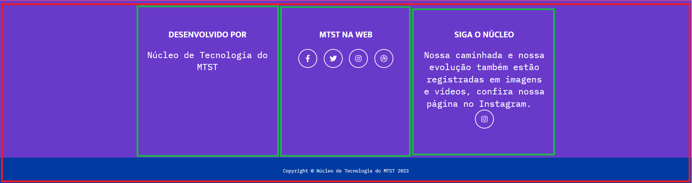
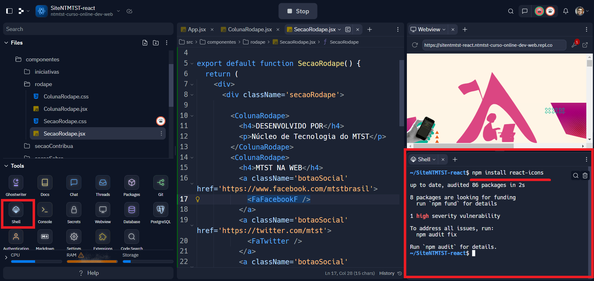

# Aula 7

Nesta aula vamos dar um próximo salto no desenvolvimento de websites: vamos aprender sobre Bibliotecas e como utilizá-las na prática. 

**Nossa tarefa será desenvolver o Rodapé** do Site do Núcleo de Tecnologia

## O que são bibliotecas?

Vamos imaginar que você precisa fazer um bolo. Você pode começar do zero, misturando farinha, açúcar, ovos e outros ingredientes. Mas isso pode ser complicado, especialmente se você nunca fez um bolo antes.

Agora, imagine se você tivesse uma caixa de mistura para bolo. Nela já vem tudo o que você precisa, e você só precisa adicionar alguns ingredientes, como água ou ovos, e seguir as instruções na caixa. Isso faz com que seja muito mais fácil e rápido fazer um bolo, não é?

Em programação, especialmente em JavaScript, uma biblioteca é como uma caixa de mistura para bolo. Ela é uma coleção de códigos que outras pessoas escreveram e que você pode usar no seu projeto para facilitar o seu trabalho. Em vez de ter que escrever todo o código do zero, você pode usar a biblioteca para fazer coisas complexas de maneira mais fácil e rápida.

## Preparação para o uso da biblioteca

Vamos utilizar a biblioteca para trazer alguns icones interessantes para o uso no site, para isso vamos utilizar a biblioteca [`react-icons`](https://react-icons.github.io/react-icons/) mas antes de vermos como usar esta biblioteca vamos primeiro criar os componentes onde serão usadas.

Se abrirmos o site do núcleo vamos ver que a seção do rodapé pode ser subdividida em 2 partes, que vamos chamar de SecaoRodape e ColunaRodape


Com isso em mente vamos criar nossos dois novos componentes.

Em `./src/componentes/rodape/SecaoRodape.jsx`:
```js
import './SecaoRodape.css'
import ColunaRodape from './ColunaRodape';

export default function SecaoRodape() {
  return (
    <div>
      <div className='secaoRodape'>
        <ColunaRodape>
          <h4>DESENVOLVIDO POR</h4>
          <p>Núcleo de Tecnologia do MTST</p>
        </ColunaRodape>
        <ColunaRodape>
          <h4>MTST NA WEB</h4>
          <p>icones virão aqui</p>
        </ColunaRodape>
        <ColunaRodape>
          <h4>SIGA O NÚCLEO</h4>
          <p>Nossa caminhada e nossa evolução também estão registradas em imagens e vídeos, confira nossa página no Instagram.</p><p>Icone virá aqui</p>
        </ColunaRodape>
  
      </div>
      <div className="copyright">Copyright © Núcleo de Tecnologia do MTST 2023</div>
    </div>
  )
}
```
Em `./src/componentes/rodape/SecaoRodape.css`:
```css
.secaoRodape {
  color: white;
  display: flex;
  justify-content: center;
  width: 100%;
  background-color: rgb(105 57 202);
  padding-bottom: 24px;
}

.botaoSocial {
  border-radius: 100%;
  display: inline-flex;
  justify-content: center;
  align-items: center;
  width: 46px;
  height: 46px;
  font-size: 1.25rem;
  border: 2px solid white;
  margin: 0px 8px;
  margin-bottom: 8px;
  color: white;
}

.botaoSocial:hover {
  color: black;
  background-color: white;
}

.copyright {
  background-color: #013ba2;
  color: white;
  padding: 24px;
}
```

e o ColunaRodape
Em `./src/componentes/rodape/ColunaRodape.jsx`:
```js
import './ColunaRodape.css';

export default function ColunaRodape(props) {
  return (
    <div className="colunaRodape">{props.children}</div>
  )
}
```
Em `./src/componentes/rodape/ColunaRodape.css`:
```css
.colunaRodape {
  width: 300px;
  padding: 0px 12px;
}

```

Pronto, o esqueleto dos novos componentes está pronto.

Não se esqueça: 
***Se não importar não vai funcionar!***

Por isso se certifique de importar os componentes corretamente no App e demais locais caso necessário.

## Como utilizar bibliotecas

Para a parte nova, vamos começar incluindo a biblioteca que queremos usar no nosso projeto, para isso abra a linha de comando(shell) e vamos seguir o que a documentação nos instrui a fazer:



1. Rode o comando `npm install react-icons`;
2. Espere concluir a instalação do pacote;
3. Importe os icones(componentes) que desejar nos componentes que quiser.

> Repare aqui que estamos importando esses icones como componentes react mesmo, isso porque essa biblioteca usa eles dessa maneira, cada biblioteca tem uma função e cada uma irá fazer alguma coisa de um jeito(explicado na documentação dela)

Exemplo de uso da biblioteca dentro do componente:
```js
import { DiJava } from 'react-icons/fa';
export default function ComponenteCafe {
  return(<h3> Olha o cafezinho <DiJava /> </h3>)
}
```

Com isso em mente vamos colocar os icones nos devidos locais dentro dos componentes recém criados.

Em `./src/componentes/rodape/SecaoRodape.jsx`:
```js
import './SecaoRodape.css'
import ColunaRodape from './ColunaRodape';
import { FaFacebookF, FaTwitter, FaInstagram, FaDribbble } from 'react-icons/fa'

export default function SecaoRodape() {
  return (
    <div>
      <div className='secaoRodape'>
        
        <ColunaRodape>
          <h4>DESENVOLVIDO POR</h4>
          <p>Núcleo de Tecnologia do MTST</p>
        </ColunaRodape>
        <ColunaRodape>
          <h4>MTST NA WEB</h4>
          <a className='botaoSocial' href='https://www.facebook.com/mtstbrasil'>
            <FaFacebookF />
          </a>
          <a className='botaoSocial' href='https://twitter.com/mtst'>
            <FaTwitter />
          </a>
          <a className='botaoSocial' href='https://www.instagram.com/mtstbrasil/'>
            <FaInstagram />
          </a>
          <a className='botaoSocial' href='https://mtst.org/'>
            <FaDribbble />
          </a>
        </ColunaRodape>
        <ColunaRodape>
          <h4>SIGA O NÚCLEO</h4>
          <p>
            Nossa caminhada e nossa evolução também 
            estão registradas em imagens e vídeos, 
            confira nossa página no Instagram.
          </p>
          <a className='botaoSocial' href='https://www.instagram.com/tecnologia.mtst/'>
            <FaInstagram />
          </a>
        </ColunaRodape>

      </div>
      <div className="copyright">Copyright © Núcleo de Tecnologia do MTST 2023</div>
    </div>
  )
}
```

E o **ColunaRodape** não tem alteração.

Resultado final: [Repl.it](https://replit.com/@ntmtst-curso-online-dev-web/SiteNTMTST-react)

## Estrutura final do projeto

```
.
├── App.css
├── App.jsx
├── componentes
│   ├── BannerInicio.css
│   ├── BannerInicio.jsx
│   ├── iniciativas
│   │   ├── CardIniciativa.css
│   │   ├── CardIniciativa.jsx
│   │   ├── SecaoIniciativas.css
│   │   └── SecaoIniciativas.jsx
│   ├── rodape
│   │   ├── ColunaRodape.css
│   │   ├── ColunaRodape.jsx
│   │   ├── SecaoRodape.css
│   │   └── SecaoRodape.jsx
│   ├── secaoContribua
│   │   ├── SecaoContribua.css
│   │   └── SecaoContribua.jsx
│   └── secaoSobre
│       ├── secaoSobre.css
│       └── secaoSobre.jsx
└── index.jsx
```
