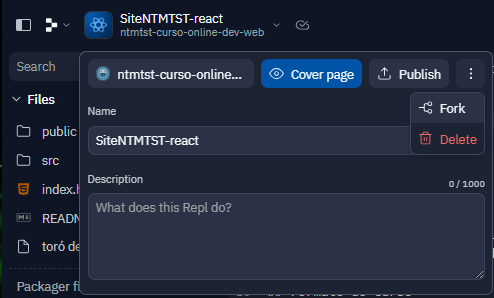

# Aula 8

Olá! Esta é a nossa última aula deste intensivo de React. Durante este curso, aprendemos os conceitos básicos e iniciais do React copiando grande parte do site do Núcleo de Tecnologia do MTST utilizando o Replit.

Na aula de hoje vamos criar uma cópia do Replit com o Site do Núcleo. Nesta cópia, vamos passar por todos os componentes alterando textos, imagens, cores e etc para que o site não seja mais sobre o Núcleo, **mas sim sobre qualquer outro tema que você escolher**.

No exemplo da aula, o tema escolhido foi "gatos". Para seu projeto, você deve escolher outro tema: pode ser sobre objetos, animais, sobre você (página de apresentação profissional), sobre sua cidade, hobbies, atividades físicas que gosta, etc. 

**A ideia principal é customizar o site para ser algo de sua escolha**.

## Criando uma cópia do site

Para criar uma cópia do seu site, vá no Replit, clique no nome do projeto, clique nos 3 pontinhos que aparecerá à direita e clique em "Fork":


## Fazendo as alterações no site

Para começar as alterações, vamos abrir nosso `App.jsx`. Neste arquivo, vamos ver quais componentes nosso site está exibindo:

```jsx
export default function App() {
  return (
    <main>
      ... // Aqui estarão os componentes que o seu site exibe
    </main>
  )
}
```

Agora que localizamos os componentes no App.jsx, vamos passar por cada um deles editando o conteúdo, cores e imagens. Vamos fazer o primeiro componente juntos. As mesmas regras serão aplicadas para os demais componentes.

### Pensando no conteúdo

Antes de mais nada, defina o seu conteúdo e pense em como alterar as seguintes áreas do site

#### Banner Inicial


### Alterando os componentes 

Para exemplificar, vamos pegar o primeiro componente `BannerInicio`. 

#### Passo 1: entrar no arquivo do componente

Vamos abrir o arquivo `BannerInicio.jsx`. 

####

Ainda no `App.jsx`, vamos olhar as `props` que são passadas para o componente. Não há nenhuma `prop` passada para este componente