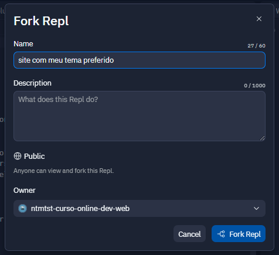

# Aula 8

Olá! Esta é a nossa última aula deste intensivo de React. Durante este curso, aprendemos os conceitos básicos e iniciais do React copiando grande parte do site do Núcleo de Tecnologia do MTST utilizando o Replit.

Na aula de hoje vamos criar uma cópia do Replit com o Site do Núcleo. Nesta cópia, vamos passar por todos os componentes alterando textos, imagens, cores e etc para que o site não seja mais sobre o Núcleo, **mas sim sobre qualquer outro tema que você escolher**.

No exemplo da aula, o tema escolhido foi "gatos". Para seu projeto, você deve escolher outro tema: pode ser sobre objetos, animais, sobre você (página de apresentação profissional), sobre sua cidade, hobbies, atividades físicas que gosta, lugares que já visitou, lugar que mais gostou de visitar e por aí vai!  **A ideia principal é customizar o site para ser algo de sua escolha e que seja um assunto relevante para você**.

## Criando uma cópia do site

Para criar uma cópia do seu site, vá no Replit, clique no nome do projeto, clique nos 3 pontinhos que aparecerá à direita e clique em "Fork":

Ao clicar em "Fork", uma nova tela abrirá ao centro da página. Escolha um nome para o seu projeto e clique em "Fork Repl":

Pronto, agora você tem uma cópia do seu projeto para começar a customizar.

## Antes de mais nada: planeje as alterações

Defina o seu tema e planeje como substituir o conteúdo de todas as seções:
- **Banner Inicial**: Neste banner, temos 2 imagens: uma que está sendo chamada no `BannerInicio.jsx` e outra que está no `BannerInicio.css`. Altere as 2 imagens como desejar. Dica: copie imagens da internet clicando com o botão direito do mouse em cima da imagem e depois selecione "Copiar endereço da imagem". Então, vá ao Replit e cole o caminho copiado
- **Seçao Iniciativas**: Nessa seção temos 3 imagens com 3 títulos diferentes para cada uma. Escolha 3 imagens da internet relacionadas com o seu tema e substitua aqui. Altere também os títulos de cada imagem. Não se esqueça também de mudar o título da Seção toda
- **Seçao Sobre**: Aqui, altere o título da seção toda e os textos que são exibidos. Os textos do conteúdo são passados via `props`, então para alterar o conteúdo você precisará alterar no `App.jsx`
- **Seçao Contribua**: Similar à seção sobre
- **Rodape**: Altere os textos dessa seção e também os ícones. Para alterar os ícones, vá à página do [React-icons](https://react-icons.github.io/react-icons/) e selecione ícones diferentes do que temos hoje na página

⚠️ importante: você pode trocar a ordem dos componentes também! Por exemplo, a Seção Sobre pode vir antes da Seção Iniciativa e por aí vai. Seja criative 🎨

## Fazendo as alterações no site

Uma vez que você definiu seu tema e já pensou sobre como alterar cada uma das seções acima, vamos iniciar as modificações!

Se não souber por onde começar, abra o `App.jsx` e veja dentro da tag `<main>`. Lá é onde vamos ter nossos componentes. É aqui dentro da tag `main` que podemos também mudar a ordem dos componentes se quisermos! Faça um teste alterando a ordem das seções. Veja o resultado no Replit.

Agora para cada componente dentro da `main`, abra o arquivo corresponde e coloque o novo conteúdo sobre seu tema.

Se atente aos componentes que usam `props`. Além de mexer no arquivo do componente, você precisará modificar no `App.jsx` as propriedades que estão sendo passadas.

## Exemplo Pronto com o Tema "Gatos"

⚠️ Perceba que neste exemplo a Seção Sobre mudou de posição. Agora ela é exibida logo abaixo do Banner Inicio:

## Conclusão

Estamos animades para ver o que cada pessoa cria nesta etapa! Não se esqueça de compartilhar com os instrutores e seus colegas do intensivo! :D